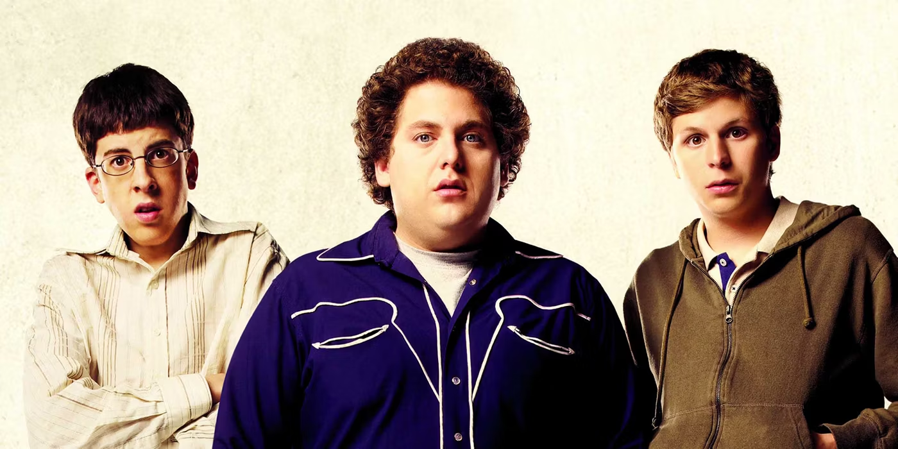
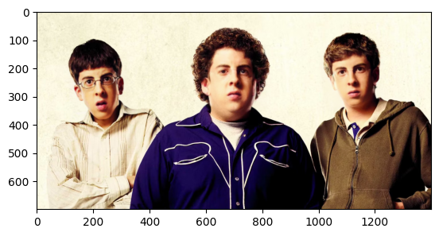

# Synthetic Media Generation - DeepFakes

### Installation

### Creating virtual env to test

- run `python3 -m venv <name_of_env>` to create new virual environment

- run `pip install -r requirements.txt` to install necessary libraries and packages

- run `deactivate` to close virtual environment

### Testing face swapping with insight face

- Replace superBad.png with your own png and repace naming conventions of the image in the face_swap.ipynb

- Results from running all files will need minium of 2 faces in the image to run and replaces all faces with the image of the 2nd face recognized in the file

# Input
  

# Results
  

Credits -
- face_swap tutorial - https://www.youtube.com/watch?v=a8vFMaH2aDw&t=505s

- Using weights from [inswapper_128.onnx](https://drive.google.com/file/d/1QgfexAqiVYcKd8QJnXTBEjtU1Wm8fmU-/view?usp=sharing) and put it in the assets folder to run the face swapper

- deep learning-based library from [insightface](https://github.com/deepinsight/insightface)

### stt - speech to text [faster whisper](https://github.com/SYSTRAN/faster-whisper)
